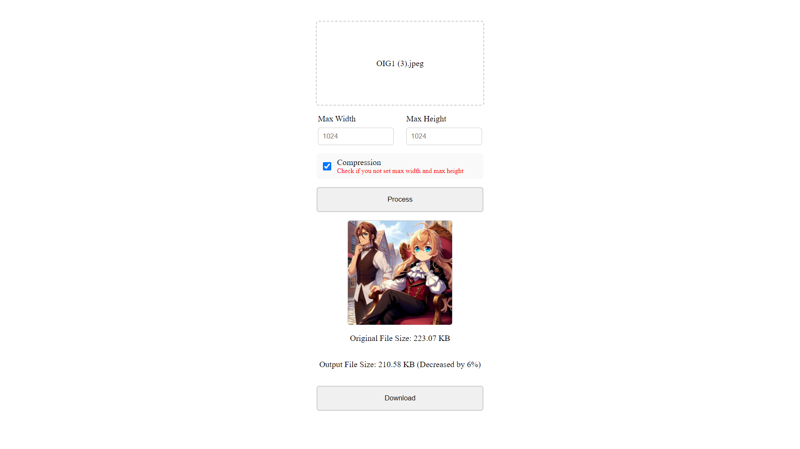
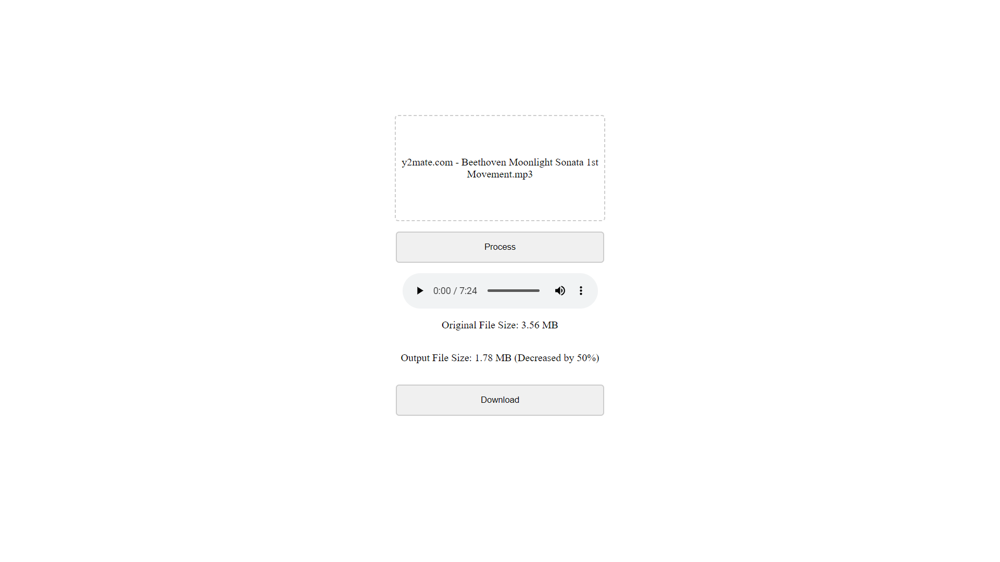

## TINY-MEDIA

Tiny-Media adalah web-app yang berfungsi untuk mengkompres gambar dan audio tanpa mengurangi kualitasnya. Kamu bisa menggunakannya secara gratis tanpa perlu login dan upload ke server kami, semua proses dilakukan di browser kamu. 100% privasi terjamin.

## Tech Stack

- [Next.js](https://nextjs.org/)
- [Emotion](https://emotion.sh/docs/introduction)
- [@breezystack/lamejs](https://www.npmjs.com/package/@breezystack/lamejs) on npmjs
- [browser-image-compression](https://www.npmjs.com/package/browser-image-compression) on npmjs

## Screenshot

